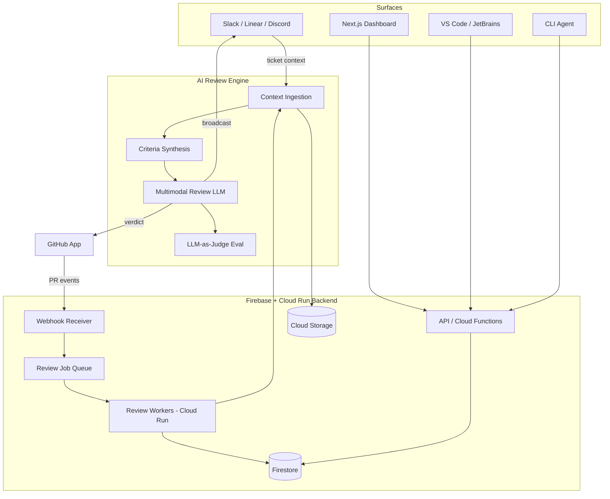
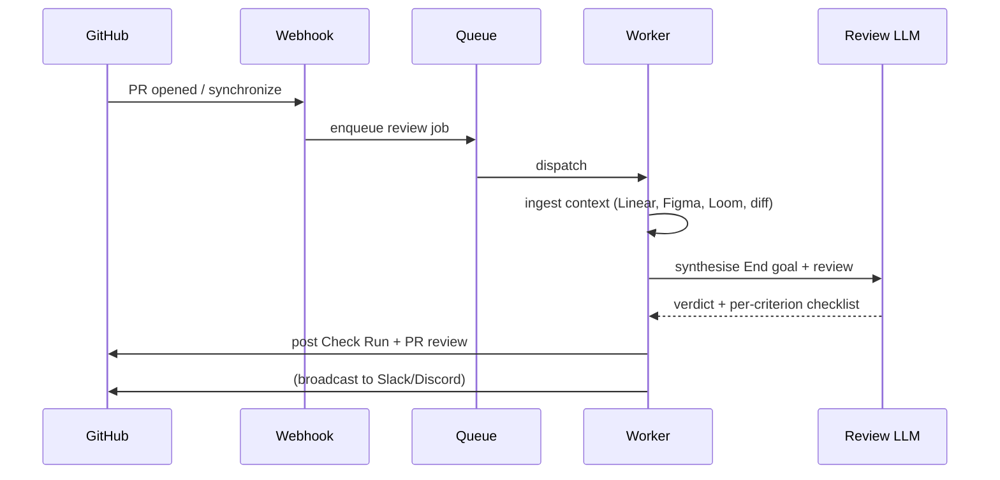

# DevAsign - App Design Document

## Overview
DevAsign ingests your ticket, linked issues, screenshots, Figma frames, and Loom walkthroughs — then reviews every PR against what was actually asked. 

## Features
- Multimodal AI agent that reviews PRs against what was actually asked
- Connect Slack, Linear or Discord so the agent can pull ticket context and broadcast review verdicts to your team
- Install the review agent in your IDE, and / or in your CLI vibe-coding workflow

## Authentication
- GitHub OAuth

## Integration
- GitHub
- Slack
- Linear
- Discord

## IDE extensions
- VS Code
- JetBrains

## Onboarding
- Install DevAsign GitHub App on your repositories
- (Optional) connect Slack, Linear or Discord so the agent can pull ticket context and broadcast review verdicts to your team
- (Optional) Install the review agent in your IDE, and / or in your CLI vibe-coding workflow

## App Structure

### Agents
- Stats: tasks/issues, open PR reviews, tasks resolved
- Review queue: all open PR being reviewd by the agent
- Review log: agent activity per pull request
- Message agent: user send instructions to the agent (links, screenshots, loom etc) and agents ingests the instructions and review the PRs based on the instructions
- End goal: acceptance criteria & requirements the selected PR in "review queue" must meet before it can be merged, all obtained from sources (tickets/PR descriptions, loom/screen recordings, images/Figma/PDF, docs etc)

### Settings
- Installation: GitHub, IDE plugin, CLI agent
- Integrations: Slack, Linear, Discord
- Review models: set default LLM, choose LLM per repo
- Usage: activity credit balance, buy credits, auto refill 
- Plans & billing: switch plan, manage payment methods on Stripe, cancel subscription
- Support: documentaion, discord community, email support, status page

---

# Technical Build Overview

## 1. The system in one picture

The product is three subsystems wired together by the **pull request lifecycle** — a PR opens, the agent reviews it, a human merges.

1. **Identity & install layer** — who you are (GitHub OAuth) and what the agent can touch (GitHub App installation).
2. **The review engine** — the hard, differentiating part. Pulls context from many sources, synthesises an "End goal," reviews PRs against it, posts verdicts.
3. **Surfaces** — the web dashboard, IDE extensions, CLI agent, and the Slack/Linear/Discord integrations.

---

## 2. Recommended stack

This leans into what you already run so you're not maintaining two paradigms.

| Layer | Choice | Why |
|---|---|---|
| Frontend | **Next.js (App Router) + TypeScript + Tailwind** | Fast to vibe-code, server components for the dashboard, your design system drops straight in. |
| Auth | **GitHub OAuth** for identity, **GitHub App** for repo access | These are two different things (see §4). Firebase Auth can wrap the OAuth identity. |
| Backend | **Firebase** (Firestore, Cloud Functions, Cloud Storage) + **Cloud Run** for workers | Functions for webhooks/API; Cloud Run for the long-running review jobs that blow past Functions' timeout. |
| Job queue | **Cloud Tasks** or **Pub/Sub** | Reviews are async and bursty; never run them inline in the webhook handler. |
| LLMs | **Claude / Gemini** (multimodal), per-repo configurable | Gemini or Claude for vision on screenshots/Figma frames; transcription via Gemini or Whisper. |
| Billing | **Stripe** (metered usage + plans) | Agent review credits as metered billing — your SaaS monetisation, fully off-chain. |
| IDE/CLI | VS Code extension (TS), JetBrains plugin (Kotlin), CLI (Node) | Thin clients that call your backend API. |

Design tokens are already settled: near-black background, `#FE891F` accent, JetBrains/IBM Plex Mono for code, Space Grotesk for UI. Build the dashboard shell on those from day one so every screen lands consistent.

---

## 3. Data model (Firestore sketch)

Core collections you'll need. Most of the app's logic is just transitions on `PRReview.status`.

- **users** — `{ githubId, email, plan }`
- **installations** — GitHub App installs: `{ accountId, installationId, repoIds[] }`
- **repositories** — `{ installationId, name, defaultModel, modelOverrides }`
- **integrations** — `{ userId, type: slack|linear|discord, tokens, workspaceMeta }`
- **tasks** — the unit work is tracked against: `{ source, externalId, title, endGoal }`
- **prReviews** — `{ repoId, prNumber, status: queued|reviewing|passed|changes_requested, verdict, criteria[], logRef }`
- **reviewLogs** — append-only agent activity per PR (this powers the Review Log screen)
- **subscriptions** — Stripe state, credit balance
- **authAudit** — append-only log for the Security screen (recent authorizations, 2FA events)

---

## 4. Auth & install layer (build this first)

The single most common thing teams get wrong here: **OAuth ≠ GitHub App.**

- **GitHub OAuth** answers *"who is this user?"* → identity, login, profile.
- **GitHub App** answers *"what repos can the agent read/write?"* → installation tokens, webhook subscription, PR review/check permissions.

You need both. The onboarding flow:

1. User signs in with GitHub OAuth → create/lookup `user`.
2. User installs the DevAsign GitHub App on selected repos → you receive an `installation` + webhook stream.
3. App requests **least-privilege** permissions: PRs (read/write), Checks (write), Contents (read), Issues (read), Metadata (read). Resist asking for more — it spooks teams and widens your blast radius.

Store the installation ID, exchange it for short-lived installation tokens per request rather than holding long-lived creds.

---

## 5. The review engine (your moat — spend the most time here)

This is the "End goal" feature in your spec, made real. It's an async pipeline, not a request/response. A PR event lands → you enqueue a job → a worker runs the pipeline → results get posted back.

### Pipeline stages

**a. Context ingestion** — gather everything the PR should be judged against:
- *GitHub*: PR diff, changed files, description, commits, linked issues.
- *Linear*: issue description + comments via GraphQL.
- *Slack/Discord*: the thread/channel the task lives in.
- *Figma*: node images + design metadata via the Figma API.
- *Loom*: pull the transcript (Loom exposes transcripts); optionally sample frames for visual checks.
- *Screenshots/PDF*: store in Cloud Storage, pass images to a vision model, parse PDFs to text.

The "Message agent" screen feeds straight into this — links, screenshots, and Looms a user sends are just additional ingestion inputs attached to the task.

**b. Criteria synthesis** — one LLM pass that distills all that raw context into structured, checkable acceptance criteria. This *is* the "End goal" object. Persist it on the task so it's visible and editable in the UI, not a black box.

**c. Review** — a multimodal LLM evaluates the PR diff against each criterion → produces a verdict (pass / changes-requested), a per-criterion checklist, and inline comments.

**c.1 DEVASIGN.md guidance** — teams commit `DEVASIGN.md` files into their repo to encode their own conventions (the way they'd use `AGENTS.md` / `CLAUDE.md`). The agent reads every `DEVASIGN.md` on the path of each changed file — root → leaf, so a subdirectory's doc governs only files under it — and checks the diff against the rules that govern it. Violations the diff *newly introduces* surface as **nit-level** findings; and bidirectionally, if the diff makes a `DEVASIGN.md` statement outdated, it flags the docs for updating. Both are advisory nits — they never gate the merge. Skipped entirely (no LLM call) when no `DEVASIGN.md` governs a changed file.

**d. Output** — post a GitHub Check Run + PR review, write to `reviewLogs`, broadcast the verdict to the connected Slack/Discord channel. The verdict is advisory — the human still decides to merge.

**e. Eval** — run your LLM-as-judge harness (the evals platform you've already specced) over a sample of reviews to track quality regressions as you change prompts/models.

### Hard parts to plan for now
- **Long jobs**: multimodal review + transcription will exceed Cloud Functions timeouts. Run workers on **Cloud Run**; keep Functions only for the thin webhook receiver that enqueues.
- **Cost**: cache synthesised criteria; don't re-ingest unchanged context on every `synchronize` event. Make model choice per-repo (your Settings spec already calls for this) so cheap repos use cheap models.

---

## 6. Integrations & client surfaces

- **Slack** (Bolt), **Discord** (discord.js + OAuth), **Linear** (GraphQL SDK): each is OAuth-in to read context + a bot/webhook-out to broadcast verdicts. Build the ingestion side first (it feeds the engine); broadcast is a fast follow.
- **IDE extensions / CLI**: thin clients. They authenticate to your backend and call the same review API the web app uses, drawing down the same Stripe-metered credits.
- **Billing (Stripe)**: model agent reviews as metered usage; plans gate model access and review volume. Tie credit depletion to the Settings → Plans screen.

---

## 7. Suggested build order

Get the core loop alive before anything fancy.

- **Phase 0 — Foundations**: GitHub OAuth + App install, repo connection, dashboard shell on your design system, Firestore schema.
- **Phase 1 — Review loop MVP**: webhook → queue → worker → single-source review (just GitHub issue + diff) → post Check Run + Review Log. This proves the spine.
- **Phase 2 — Multimodal context**: Linear/Slack/Discord ingestion, Figma, Loom, screenshots/PDF, criteria synthesis, the Message-agent screen, the End-goal object.
- **Phase 3 — Monetise & extend**: Stripe billing, per-repo model config, IDE/CLI clients, eval harness in CI.

---

## 8. Decisions to lock early (cheap now, expensive later)

1. **Functions vs Cloud Run split** — don't try to run reviews inside Cloud Functions.
2. **Context caching strategy** — or LLM costs will scale with PR push frequency, not PR count.
3. **GitHub App permission scope** — least privilege; it affects sales conversations with security-conscious teams.
4. **Per-repo model config shape** — defaulting + override hierarchy is easier to design now than retrofit.

---